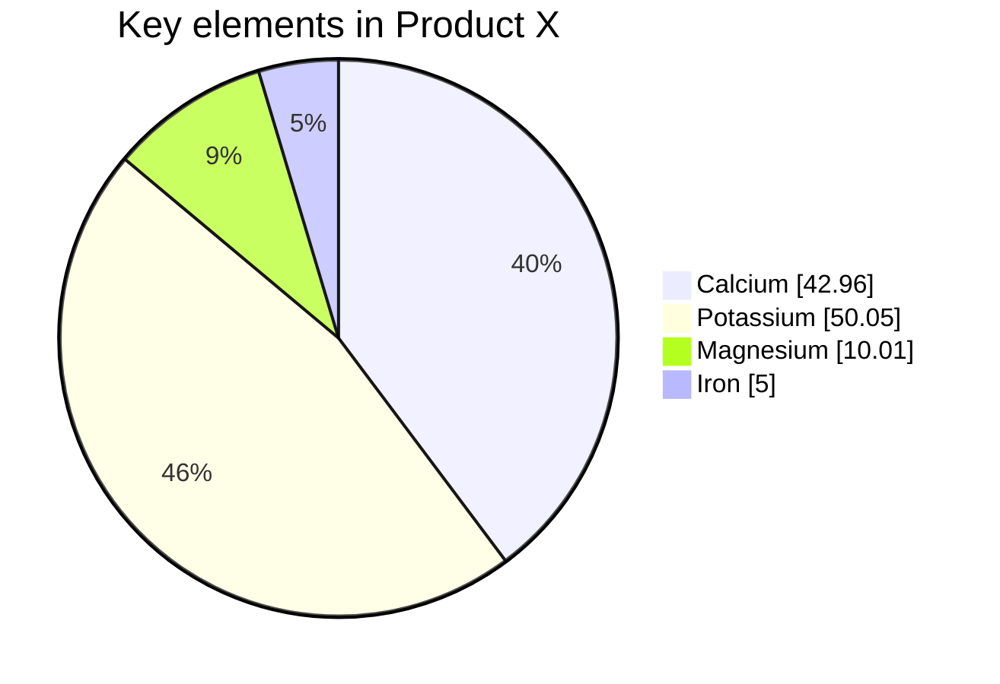

<!--    -->
<!--      -->
  <samp>
    :wave: Hi! I'm Josh and do code for <a href="https://www.abc.net.au/news">ABC News</a>.
      I'm currently doing stories and stuff and building new things.
      I like animals and sometimes I make music etc. :sparkles: 
    <!--  -->
     
      🦜 Would you like to know more? :point_right: Follow me on <a href="https://twitter.com/phocks">twitter</a>
     :money_with_wings: Got a dollar and a kind heart? Sponsor my open-source projects <a href="https://github.com/sponsors/phocks">here</a>. 
    (and be sure to follow my current sponsors).
  </samp>

  
<b>:alien: Send encrypted emails...</b>

... to byrd.joshua@protonmail.com
  
<pre>-----BEGIN PGP PUBLIC KEY BLOCK-----
Version: OpenPGP.js v4.10.10
Comment: https://openpgpjs.org

xjMEYjk3CxYJKwYBBAHaRw8BAQdA+o/ag7KmJdgkgJLQCVnOP4p5zFw5qnfj
cn71Rt5GzKrNKEpvc2h1YSBCeXJkIDxieXJkLmpvc2h1YUBwcm90b25tYWls
LmNvbT7CdwQQFgoAHwUCYjk3CwYLCQcIAwIEFQgKAgMWAgECGQECGwMCHgEA
CgkQZmChwDdG6iLUbAD+ONXg7p1l2v8/FcaKvr8aJ4LNuTzkLqiTIK2xlH/F
RSIA/2st5shNFpmVqLRsk7XBcfQkFjiFlxSBV00EXNUrYZgJzjgEYjk3CxIK
KwYBBAGXVQEFAQEHQLCphz4B9fp6iz9yMZ2arghCDFRNkbxWatX1liDv1L51
AwEIB8JhBBgWCAAJBQJiOTcLAhsMAAoJEGZgocA3RuoiOPkBAPyIfBmZweyp
+1KY3Ni0rDakOI3Yn0Zgtdg2b7mBqDWxAQD/uulXkvQfrq/PQ/hOTO1U1fnA
HPwbAiFnoQlfO+fxBw==
=NZVx
-----END PGP PUBLIC KEY BLOCK-----</pre>
 

 
 
 

  
...to phocks@gmail.com
  
<pre>-----BEGIN PGP PUBLIC KEY BLOCK-----
Version: OpenPGP.js v4.10.10
Comment: https://openpgpjs.org

xjMEYjkJDxYJKwYBBAHaRw8BAQdA+9c4Vrucof1W9tWituooXvwAxf22PTpH
gHcOvI2WUhfNHkpvc2h1YSBCeXJkIDxwaG9ja3NAZ21haWwuY29tPsJ3BBAW
CgAfBQJiOQkPBgsJBwgDAgQVCAoCAxYCAQIZAQIbAwIeAQAKCRCxIp8kKunC
B9reAQCGNNY7lUWw4ZZ9SPdqwICBResOMb4KM9RVEP+Naa72yQEArUf/R8lL
lCelS2St2LP567EBiqLmqLeKpve2nUCMgwvOOARiOQkPEgorBgEEAZdVAQUB
AQdAhV72VIuu0R2i1hyKAhLadIAM7e3w8l4TJIwxg/6ZzV4DAQgHwmEEGBYI
AAkFAmI5CQ8CGwwACgkQsSKfJCrpwgdBgQEAzga09UZYjV3Luc7jiCmOmEbZ
fuIJwu64jVHMnTa6eDABAMG4hloCyh22xQ+HmLTmjLE1Zm7kZoE+2++tY1Ll
sUQM
=/6cI
-----END PGP PUBLIC KEY BLOCK-----
</pre>

  
<b>:telescope: 2022 goal</b>

  
2022: Things are getting back to normal slowly. I want to find some stability this year.

  
2021: This year has been crazy and I think it's only going to get crazier. Anything I achive this year will be great. Hopefully we buy a little house so we have somewhere to raise our daughter Vada.

And some charts for fun!

